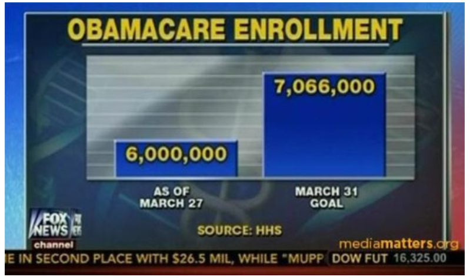

class: center, middle

.linea-superior[]
.linea-inferior[]


## Capacitación en R

## Visualización usando ggplot

### septiembre 2020

```{r setup, include=FALSE}
options(htmltools.dir.version = FALSE)
knitr::opts_chunk$set(message = FALSE) 
```

```{r xaringan-themer, include=FALSE, warning=FALSE}
library(xaringanthemer)
#style_duo_accent(
 # primary_color = "#1381B0",
  #secondary_color = "#FF961C",
  #inverse_header_color = "#FFFFFF"
#)
```


---

background-image: url("imagenes/fondo2.PNG")
background-size: contain;
background-position: 100% 0%

# Contenidos de hoy

- Conceptos básicos de visualización

--

- Elementos básicos de ggplot  


---

background-image: url("imagenes/fondo2.PNG")
background-size: contain;
background-position: 100% 0%

# La importancia de la visualización

La visualización juega un rol importante en las etapas del análisis de datos:

- Exploración

- Modelamiento

- Comunicación

--

*"The simple graph has brought more information to the data analyst's mind than any other device."* - [John Tukey](https://es.wikipedia.org/wiki/John_W._Tukey)


--

**Los gráficos nos permiten comunicar y atraer la atención de una audiencia**: [The Joy of Stats](https://www.youtube.com/watch?v=V8lbiiTF2P0)

???
Los principales objetivos de los gráficos en estadística son: 
i) facilitar comparaciones
ii) identificar tendencias

---
background-image: url("imagenes/fondo2.PNG")
background-size: contain;
background-position: 100% 0%

# La importancia de la visualización

## [John Snow](https://es.wikipedia.org/wiki/John_Snow) es considerado el padre de la epidemiología 


---

background-image: url("imagenes/fondo2.PNG")
background-size: contain;
background-position: 100% 0%

# La importancia de la visualización

## [Matejka & Fitzmaurice, 2017](https://www.autodeskresearch.com/publications/samestats) 

.center[

]


---

background-image: url("imagenes/fondo2.PNG")
background-size: contain;
background-position: 100% 0%

# Visualizaciones no efectivas


.center[

]


---

background-image: url("imagenes/fondo2.PNG")
background-size: contain;
background-position: 100% 0%

# Visualizaciones no efectivas

.center[

]


---

background-image: url("imagenes/fondo2.PNG")
background-size: contain;
background-position: 100% 0%

# Visualizaciones no efectivas


---

background-image: url("imagenes/fondo2.PNG")
background-size: contain;
background-position: 100% 0%

# Visualización efectiva

## Variables para mostrar atributos (Ward, Grinstein & Keim, 2015, Interactive Data Visualization)


- Posición
- Marca
- Tamaño
- Brillo
- Color
- Orientación
- Textura
- Movimiento
- Efecto de las variables visuales

--

## No es aconsejable incluir demasiados atributos en una misma visualización


---
background-image: url("imagenes/fondo2.PNG")
background-size: contain;
background-position: 100% 0%


# Visualización efectiva

Los gráficos requieren de nuestra capacidad visual para interpretar figuras geométricas.

--

[Cleveland & McGuill (1985)](http://webspace.ship.edu/pgmarr/Geo441/Readings/Cleveland%20and%20McGill%201985%20-%20Graphical%20Perception%20and%20Graphical%20Methods%20for%20Analyzing%20Scientific%20Data.pdf)

- Las mejores visualizaciones son aquellas que requieren el uso de la "visión instantánea".

- Y no requieren de un esfuerzo visual para ser comprendidas.

--

.center[La "visión instantánea" nos permite evaluar visualmente **patrones geométricos** y dimensionar **magnitudes**]

---

background-image: url("imagenes/fondo2.PNG")
background-size: contain;
background-position: 100% 0%

# Visualización efectiva

Cleveland ordena la dificultad de los elementos gráficos basado en la percepción para estimar variables cuantitativas.

--

De menor a mayor dificultad:

- **Posición** a lo largo de una escala común
- **Posición** en escalas no alineadas pero idénticas
- Longitud
- Ángulo o pendiente
- Área
- Saturación del color
- Tono del color


---


background-image: url("imagenes/fondo2.PNG")
background-size: contain;
background-position: 100% 0%


# Visualización efectiva

```{r, out.width = "700px", out.height="290px" , fig.align='center', echo=FALSE}

```

---

background-image: url("imagenes/fondo2.PNG")
background-size: contain;
background-position: 100% 0%

# Visualización efectiva

## Las tortas son para comer...

--

## [*Three reasons that pie charts suck*](https://www.richardhollins.com/blog/why-pie-charts-suck/)

.pull-left[

1. Son malos para comunicar lo básico, a menos que tengan etiquetas.

2. No son buenos para mostrar tendencias (aun cuando lo acompañen etiquetas).

3. No sirven para mostrar tendencias cuando se utilizan valores absolutos.
]

.pull-right[
]

---

background-image: url("imagenes/fondo2.PNG")
background-size: contain;
background-position: 100% 0%

# Receta para hacer ~~malos~~ gráficos

- Confunde a los demás respecto a lo que quieres mostrar (con etiquetas que no explican nada o características que no agregan información).

--

- Incluye muchos atributos (posición, color, tamaño, textura, forma)

--

- Usa un gráfico de torta (con efectos 3d).

--

- Incluye más de una escala en un mismo gráfico

--

- Si comparas más de un gráfico, ojalá utiliza distintas escalas.

--

.center[

]


---

background-image: url("imagenes/fondo2.PNG")
background-size: contain;
background-position: 100% 0%

# Ejemplo

## A partir de los conceptos revisados, ¿qué podemos decir de esta visualización?

.center[

]


---
.linea-superior[]
.linea-inferior[]


.center[
## Ahora que ya manejamos algunos conceptos, podemos pasar a `R`


]


---
background-image: url("imagenes/fondo2.PNG")
background-size: contain;
background-position: 100% 0%

# Descripción del dataset 

Trabajaremos con un dataset de nombres inscritos en el registro civil

--

Los datos se encuentran en el paquete guaguas de [Riva Quiroga](https://github.com/rivaquiroga/guaguas)

.center[

]

--


```{r, include=TRUE, eval=TRUE, warning=FALSE}
#install.packages("guaguas")
library(guaguas)
head(guaguas, 2)
```

--

### Generemos un gráfico de barras con cantidad de nombres de mujeres y de hombres


---

background-image: url("imagenes/fondo2.PNG")
background-size: contain;
background-position: 100% 0%

# Gráficos en R 

R base ofrece herramientas de visualización

--


```{r pressure, fig.align='center', fig.height=3.7, fig.width=3.7, echo=TRUE}
plot(pressure)
```

--

Entonces, ¿por qué utilizar ggplot? 

---
background-image: url("imagenes/fondo2.PNG")
background-size: contain;
background-position: 100% 0%

# Gráficos en R 


`ggplot2` sigue una sintaxis coherente, lo que facilita su aprendizaje


```{r, fig.align='center', fig.height=3.7, fig.width=3.7, echo=TRUE}
library(ggplot2)
ggplot(data = pressure) + 
          geom_point(mapping = aes(x = temperature, y = pressure))
```

--

`ggplot2` se ha convertido en el estándar para la visualización en R

Estilo sobrio y elegante

Hay librerías en python que usan el diseño de ggplot 


---
background-image: url("imagenes/fondo2.PNG")
background-size: contain;
background-position: 100% 0%

# Volvamos a nuestros datos

Queremos un gráfico de barras que nos muestre cantidad de nombres por sexo

Echaremos mano a lo aprendido en sesiones anteriores

--

```{r, message=FALSE, warning=FALSE}
library(tidyverse)
sexo <- guaguas %>% 
  group_by(sexo) %>% 
  summarise(suma = sum(n))

sexo

```


---
background-image: url("imagenes/fondo2.PNG")
background-size: contain;
background-position: 100% 0%

# La sintaxis de ggplot

`ggplot` funciona con un sistema de capas

Siempre comenzaremos con la función ggplot

--

```{r, fig.align='center', fig.height=3, fig.width=4}
ggplot(data = sexo, aes(x = sexo, y = suma)) 
```
--

* `data`: tabla para la cual queremos generar el gráfico

* `aes`: viene de *aesthetics*. Contiene los elementos estéticos de nuestro gráfico

    + `x`: variable que será mapeada al eje x 
    + `y`: variable que será mapeada al eje y

---

background-image: url("imagenes/fondo2.PNG")
background-size: contain;
background-position: 100% 0%

# La sintaxis de ggplot


```{r, fig.align='center', fig.height=4, fig.width=5}
ggplot(data = sexo, aes(x = sexo, y = suma)) + 
  geom_bar(stat = "identity") #<<
```

--

- `geom_bar`: capa de figura geométrica 

- *identity*: le dice a ggplot que no queremos hacer nada con los datos, es decir, graficar la tabla sin modificaciones 

---

background-image: url("imagenes/fondo2.PNG")
background-size: contain;
background-position: 100% 0%

# La sintaxis de ggplot

Agreguemos una segunda capa

```{r, fig.align='center', fig.height=4, fig.width=5}
ggplot(data = sexo, aes(x = sexo, y = suma)) + 
  geom_bar(stat = "identity") + 
  geom_hline(yintercept = mean(sexo$suma)) #<<
```

--

- `geom_hline`: línea horizontal 


---
background-image: url("imagenes/fondo2.PNG")
background-size: contain;
background-position: 100% 0%

# Ejercicio rápido

Creemos un gráfico de líneas que contenga la suma de personas para cada año

*Pista*: la capa para crear un gráfico de líneas es `geom_line` 

--

```{r, fig.align='center', fig.height=4, fig.width=5}
guaguas %>% 
  group_by(anio) %>% 
  summarise(suma = sum(n)) %>% 
  ggplot(aes(x = anio, y = suma)) +
  geom_line() #<<

```

---
background-image: url("imagenes/fondo2.PNG")
background-size: contain;
background-position: 100% 0%

# Agregando más atributos

Nombres de mujer más populares de 2019

```{r, fig.align='center', fig.height=4.5, fig.width=7}

top3 <- guaguas %>% 
  filter(anio == 2019 & sexo == "F") %>% 
  group_by(sexo) %>% 
  arrange(desc(n)) %>% 
  slice(1:10)
ggplot(top3, aes(x =  fct_reorder(nombre, desc(n)) , y = n, fill = nombre)) + #<<
  geom_bar(stat = "identity")
```

---

background-image: url("imagenes/fondo2.PNG")
background-size: contain;
background-position: 100% 0%

# Agregando más atributos

Con la función `labs` podemos agregar etiquetas a nuestro gráfico

La función `theme` controla características generales del gráfico: fuente, posición, tamaño de letra, etc. 


```{r, fig.align='center', fig.height=3.5, fig.width=6}
guaguas %>% 
  filter(nombre == "Salvador" & anio <= 1990) %>% 
  ggplot(aes(x = anio, y = n, color = "coral")) +
  geom_line() +
  geom_vline(xintercept = 1971, linetype="dashed") +
  labs(title="El nombre Salvador a lo largo de la historia", #<<
        x ="año", y = "frecuencia") + #<<
  theme(plot.title = element_text(hjust = 0.5)) #<< 
```


---

background-image: url("imagenes/fondo2.PNG")
background-size: contain;
background-position: 100% 0%

# Agregando más atributos y capas

```{r, fig.align='center', fig.height=5, fig.width=7.5}
guaguas %>% 
  filter(nombre %in% c("Milenka", "Branco", "Salomé", "Jovanka"), anio > 1980) %>% 
  ggplot(aes(anio, n, color = nombre)) + #<<
  geom_point() + #<<
  geom_line() +
  labs(x = "año", y = "total inscripciones",
       title = "Inscripciones de nombres de personajes de Romané") +
  theme(plot.title = element_text(hjust = 0.5)) 
```


---
background-image: url("imagenes/fondo2.PNG")
background-size: contain;
background-position: 100% 0%

# Segundo dataset

Base de datos que contiene datos de pib y esperanza de vida

```{r, warning=F}
life <-  gapminder::gapminder
head(life, 10)
```

---

background-image: url("imagenes/fondo2.PNG")
background-size: contain;
background-position: 100% 0%

# Segundo dataset

Veamos cuál es la relación entre ingreso y esperanza de vida 

```{r, fig.align='center', fig.height=4.5, fig.width=6.5}
life <-  gapminder::gapminder %>% 
  filter(year == 2007)

ggplot(life, aes(x = lifeExp, y = log(gdpPercap)) ) + 
  geom_point()


```

Aplicamos una transformación logarítmica para obtener una mejor visualización

---
background-image: url("imagenes/fondo2.PNG")
background-size: contain;
background-position: 100% 0%

# Ejercicio rápido

Agreguemos una variable para indicar el continente de cada país

*Pista*: 1) la columna continent contiene esta información. La variable `color` puede ser de ayuda 

--

```{r, fig.align='center', fig.height=5, fig.width=6.5}
ggplot(life, aes(x = lifeExp, y = log(gdpPercap), color = continent) ) + 
  geom_point()

```

---
background-image: url("imagenes/fondo2.PNG")
background-size: contain;
background-position: 100% 0%

# Ejercicio rápido

Agreguemos otra variable para indicar la población de cada país

*Pista*: La variable `size` puede ser de gran ayuda

--

```{r, fig.align='center', fig.height=5, fig.width=6.5}
ggplot(life, aes(x = lifeExp, y = log(gdpPercap), color = continent, size = pop) ) + 
  geom_point() +
  scale_size(range = c(1, 7))

```

---
background-image: url("imagenes/fondo2.PNG")
background-size: contain;
background-position: 100% 0%

# Problema: los puntos se superponen

* Tenemos, al menos, dos soluciones
    + Usar transparencia
    + Jitter

```{r, fig.align='center', fig.height=4.8, fig.width=6.5}
ggplot(life, aes(x = lifeExp, y = log(gdpPercap), color = continent, size = pop) ) + 
  geom_point(alpha = 0.6) +
  scale_size(range = c(1, 7))
```

---
background-image: url("imagenes/fondo2.PNG")
background-size: contain;
background-position: 100% 0%

# Problema: los puntos se superponen


```{r, fig.align='center', fig.height=5, fig.width=6.5}
ggplot(life, aes(x = lifeExp, y = log(gdpPercap), color = continent, size = pop) ) + 
  geom_point() +
  geom_jitter(width = 0.3) +
  scale_size(range = c(1, 7))
```

---
background-image: url("imagenes/fondo2.PNG")
background-size: contain;
background-position: 100% 0%

# Paneles separados

Con `facet_wrap` generamos un panel para cada categoría de la variable

```{r, fig.align='center', fig.height=4, fig.width=6.5}
ggplot(life, aes(x = lifeExp, y = log(gdpPercap), color = continent, size = pop) ) + 
  geom_point() +
  scale_size(range = c(1, 7)) +
  facet_wrap(~continent) #<<


```


---
background-image: url("imagenes/fondo2.PNG")
background-size: contain;
background-position: 100% 0%

# Ejercicio rápido

Seleccionemos los años 1992, 1997, 2002, 2007 y generemos un gráfico con facetas para cada uno de dichos años

---
background-image: url("imagenes/fondo2.PNG")
background-size: contain;
background-position: 100% 0%

# Ejercicio rápido (respuesta)


```{r, fig.align='center', fig.height=5, fig.width=6.5}
gapminder::gapminder %>% 
  filter(year %in% c(1992, 1997, 2002, 2007)) %>% 
  ggplot(aes(x = lifeExp, y = log(gdpPercap), color = continent, size = pop) ) + 
  geom_point() +
  scale_size(range = c(1, 7)) +
  facet_wrap(~year) #<<

```

---
background-image: url("imagenes/fondo2.PNG")
background-size: contain;
background-position: 100% 0%

# Resumen

* Figuras revisadas en la clase
  + `geom_bar`
  + `geom_point`
  + `geom_line`
  + `geom_vline`
  + `geom_hline`

* Más figuras
  + `geom_text`
  + `geom_segment`
  + `geom_boxplot`
  + `geom_polygon`
  + `geom_density`

Memorizar las funciones es una mala estrategia para mejorar en ggplot 

--

Debemos preocuparnos de 2 cosas:

1. Entender la sintaxis de ggplot

2. Aprender a buscar rápidamente en internet lo que necesitamos

---
background-image: url("imagenes/fondo2.PNG")
background-size: contain;
background-position: 100% 0%

# gganimate (bonus)

En nuestras visualizaciones la variable tiempo no se aprecia tan bien

Podemos incluir movimiento para mejorar la percepción de cómo cambia la relación entre pib y esperanza de vida a lo largo del tiempo


```{r, fig.align='center'}
#install.packages("gifski")
library(gganimate)
p <- ggplot(gapminder::gapminder, aes(gdpPercap, lifeExp, 
                           color = continent)) +
  geom_point(aes(size = pop), show.legend = FALSE) +
  scale_y_continuous(breaks = seq(20,90,10)) +
  scale_size(range = c(2,12)) + 
  scale_x_log10() +
  transition_states(year) + #<< 
  labs(title = 'Año: {closest_state}', x = 'pib p/c', y = 'esperanza de vida') + #<<
  theme(plot.title = element_text(hjust = 0.5))
```

---
background-image: url("imagenes/fondo2.PNG")
background-size: contain;
background-position: 100% 0%

# gganimate

```{r, fig.align='center'}
animate(p, renderer = gifski_renderer(), fps=10)
```

---
background-image: url("imagenes/fondo2.PNG")
background-size: contain;
background-position: 100% 0%

# Más ejemplos para motivar


.center[

]

[EPF-D3partitionR](https://klauslehmann.netlify.app/2019/07/07/en-qu%C3%A9-gastan-los-hogares-chilenos/)

[EPF-shiny](https://klaus-lehmann.shinyapps.io/epf-app/?_ga=2.98503452.206060216.1596836306-1258237829.1596836306)

---
background-image: url("imagenes/fondo2.PNG")
background-size: contain;
background-position: 100% 0%

# Más ejemplos para motivar


.center[

]


---
background-image: url("imagenes/fondo2.PNG")
background-size: contain;
background-position: 100% 0%

# Para seguir aprendiendo...

[Elegant Graphics for Data Analysis (Hadly Wickham)](https://ggplot2-book.org/index.html)

[Tutorial muy claro de ggplot](http://r-statistics.co/Complete-Ggplot2-Tutorial-Part1-With-R-Code.html)

[Tutorial y documentación de gganimate de los desarroladores](https://gganimate.com/)

[Mastering Shiny (Hadley Wickham)](https://mastering-shiny.org/index.html)


---
background-image: url("imagenes/fondo2.PNG")
background-size: contain;
background-position: 100% 0%

# Tarea para la casa

Vamos a trabajar con datos de la EPF 

La idea es practicar calculando algunos datos no representativos. 

--

.red[WARNING] datos no representativos .red[WARNING]


--

Tendrán un código que prepara la base de datos para hacer los ejercicios. Sería muy útil que se detuvieran un instante a entender cómo funciona.

--

**Tarea 1**: Construir un gráfico que muestre el ingreso y el gasto p/c promedio, según quintil de ingreso.

**Tarea 2**: Construir un gráfico que muestre el ingreso y el gasto p/c promedio, según sexo del jefe de hogar.

**Tarea 3**: Construir un gráfico que muestre el ingreso y el gasto p/c promedio, según zona (Metropolitina y resto de capitales regionales).


---

background-image: url("imagenes/fondo2.PNG")
background-size: contain;
background-position: 100% 0%

# Código auxiliar

```{r, eval=T, include=T, warning=F}
options(scipen = "999") #para eliminar notación científica

#Abrir base de la epf
epf <- read.delim("data/base-personas-viii-epf-(formato-csv).csv", sep = ";" )
names(epf) <- tolower(names(epf)) #pasar a minúscula

#Reemplazar las comas por punto
epf2 <- epf %>% 
  select(gastot_hd_pc, ing_disp_hog_hd_pc, zona =  ï..zona, jhogar, sexo) %>% 
  mutate_at(vars(gastot_hd_pc, ing_disp_hog_hd_pc), funs(as.numeric(gsub(pattern = ",", replacement = ".", x = .)) )) %>% 
  filter(jhogar == 1) #dejar un registro por hogar

#Calcular los puntos de corte para los quintiles  
quintiles <- quantile(x = epf2$ing_disp_hog_hd_pc, c(0, 0.2, 0.4, 0.6, 0.8, 1)) 

#Crear la variable quintil.
epf2 <- epf2 %>% 
  mutate(quintil =  case_when(
    ing_disp_hog_hd_pc <= quintiles[2] ~ "quntil1",
    ing_disp_hog_hd_pc <= quintiles[3] ~ "quntil2",
    ing_disp_hog_hd_pc <= quintiles[4] ~ "quntil3",
    ing_disp_hog_hd_pc <= quintiles[5] ~ "quntil4",
    ing_disp_hog_hd_pc <= quintiles[6] ~ "quntil5")
)

#Comprobar que los quintiles estén bien armados
#prop.table(table(epf2$quintil))
```


---
background-image: url("imagenes/fondo2.PNG")
background-size: contain;
background-position: 100% 0%

# Pistas para la tarea


**Pista 1**: Antes de graficar, debes preparar los datos y llevarlos a una estructura *tidy*. Usar la función `pivot_longer` es una buena idea.

```{r, echo=F, warning=F }
epf2 %>%
  group_by(quintil) %>% 
  summarise_at(vars(gastot_hd_pc, ing_disp_hog_hd_pc), funs(mean)) %>% 
  pivot_longer(-quintil, names_to = "tipo", values_to = "valor") 
```

**Pista 2**: Para generar varias columnas en una misma categoría, puedes usar el argumento `position = "dodge"` dentro de `geom_bar`

---

background-image: url("imagenes/fondo2.PNG")
background-size: contain;
background-position: 100% 0%

#Ejercicio 1

```{r, eval=T, echo=F, fig.align="center", fig.height=5, fig.width=7.5}

#Construir gráfico para ingreso y gasto, según quintil
epf2 %>%
  group_by(quintil) %>% 
  summarise_at(vars(gastot_hd_pc, ing_disp_hog_hd_pc), funs(mean)) %>% 
  pivot_longer(-quintil, names_to = "tipo", values_to = "valor") %>% 
  ggplot(aes(quintil, valor, fill = tipo )) +
  geom_bar(stat = "identity", position = "dodge")


```

---

background-image: url("imagenes/fondo2.PNG")
background-size: contain;
background-position: 100% 0%

# Ejercicio 2

```{r, eval=T, echo=F, fig.align="center", fig.height=5, fig.width=7.5}
#Construir gráfico para ingreso y gasto, según zona
epf2 %>%
  group_by(zona) %>% 
  summarise_at(vars(gastot_hd_pc, ing_disp_hog_hd_pc), funs(mean)) %>% 
  pivot_longer(-zona, names_to = "tipo", values_to = "valor") %>% 
  ggplot(aes(as.factor(zona), valor, fill = tipo )) +
  geom_bar(stat = "identity", position = "dodge")

```


---

background-image: url("imagenes/fondo2.PNG")
background-size: contain;
background-position: 100% 0%

# Ejercicio 3

```{r, eval=T, echo=F, fig.align="center", fig.height=5, fig.width=7.5}
#Construir gráfico para ingreso y gasto, según zona
epf2 %>%
  group_by(sexo) %>% 
  summarise_at(vars(gastot_hd_pc, ing_disp_hog_hd_pc), funs(mean)) %>% 
  pivot_longer(-sexo, names_to = "tipo", values_to = "valor") %>% 
  ggplot(aes(as.factor(sexo), valor, fill = tipo )) +
  geom_bar(stat = "identity", position = "dodge")

```


---
class: center, middle

.linea-superior[]
.linea-inferior[]


## Gracias


